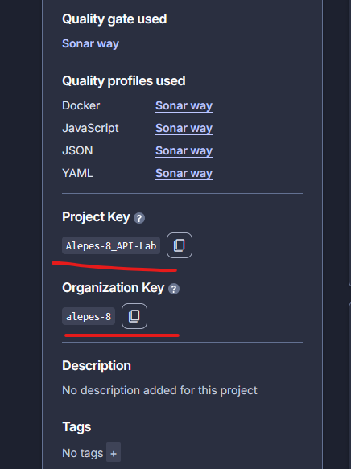

# SonarQube

When running the project, it is necessary to have the correct dependencies. Before making any adjustments or running any code, the following command must be executed to install the required dependencies:

```bash
npm install --save-dev sonarqube-scanner
```

The SonarQube setup can be done in multiple ways: either by running it locally in another container or on a dedicated server. However, if you want a free and easy-to-use version, SonarCloud is a good option.

---

## SonarCloud

SonarCloud can run and visualize SonarQube’s results in a clear and meaningful way. It is free to set up, and once it is in use, it can be used without requiring a local SonarQube installation. It requires the user to create a token on SonarCloud, which is then referenced in the workflow code and added to GitHub Actions secrets.  

All of this ensures that the code can be analyzed securely and easily.

## Setup

In order for the system to run as intended, it is important that SonarCloud has the access it requires. To achieve this, you need to set up a token under:

**Settings → Secrets and variables → Actions**

You can generate the token at:

https://sonarcloud.io/account

Go to **Security**, create a new token, and make sure to copy it before leaving the page, as it will disappear once you navigate away.

---

### Update SonarQube.yml

In the `SonarQube.yml` file, make sure to update the following properties:

```yaml
-Dsonar.projectKey=Alepes-8_API-Lab
-Dsonar.organization=alepes-8
```



Replace these values with the correct information found on the **Information** page of your project in SonarCloud (under the project you are working on).

### Add the Repository Secret

1. Go to **Settings**
2. Navigate to **Secrets and variables → Actions**
3. Click **New repository secret**
4. Name the secret:

   ```yml
   SONAR_TOKEN'
    ```
5. Paste the token you previously saved and click Save